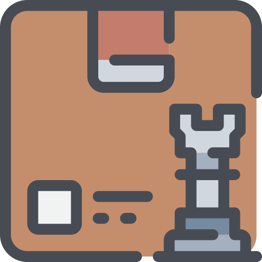
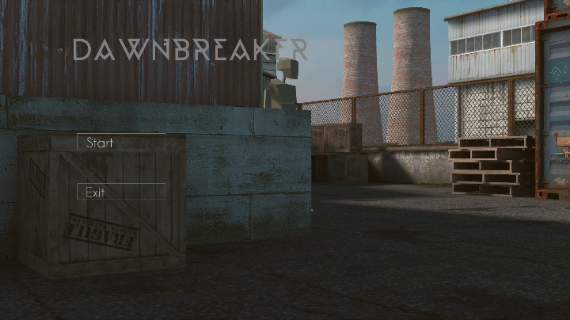
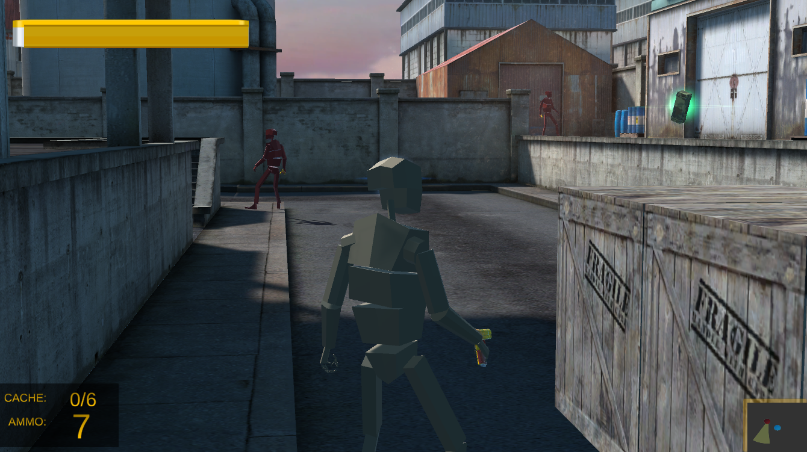
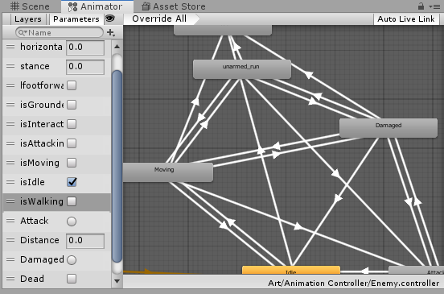
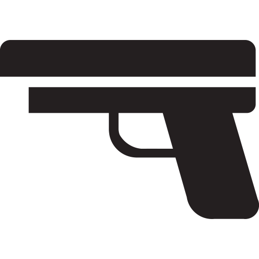
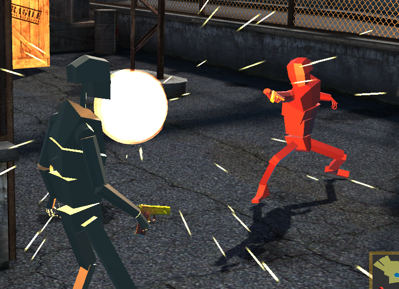
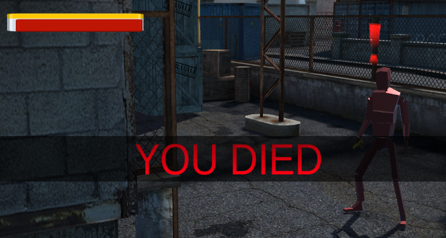
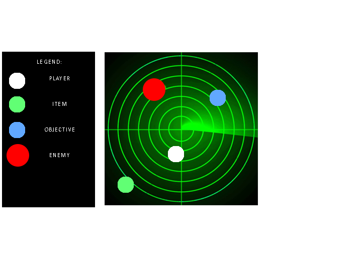
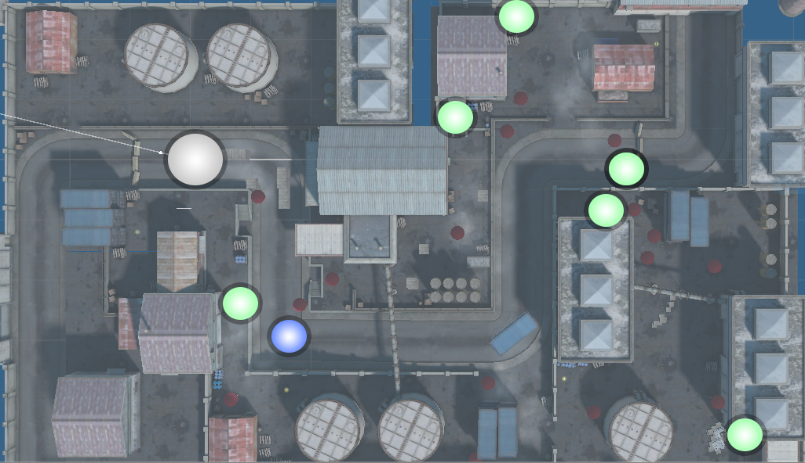

# Dawn-breaker

                                                 


> [C#/Unity] DawnBreaker is a stealth-action game built in Unity3D featuring: Field of View; Aggro Detection;  Way-Point Patrol and Return implementations

## High Concept Statement


  A freshly retired agent Virtus stumbles upon a secret conspiracy involving some of the most powerful people in the world. There he discovers that he must take up the mantle once more and work against his country, who now conspires with an enemy nation. In transit, his tracks were followed, and he was ambushed; resulting in his entire squadron being murdered. This is the story of a survivor, in his eyes a new fire of vengeance burns where righteousness once flared. His mission—to stop the delivery of this state-of-the-art armament system that will soon shake the very foundations of modern civilization. 

## PLAYER EXPERIENCE GOALS/DESIGN GOALS:



-	**Freedom of action** – The players are presented with problems that may come in the form of a puzzle or a challenge. The methods in which they solve this are up to the players and how they make use of the tools available.
-	**Subterfuge** – Sneaking by an enemy is not the only route to clearing stages; one can employ intelligence gathering through data logs that can give the player an advantage over a tough opponent. The player can also make use of their environment to create distractions. When all else fails—or if the player prefers, violence is always an option. However, it is not an easy path. Later in the game, the player will need to control two characters at exchange-ably, drastically increasing the amount of ways you can clear a stage.
-	**Strategic** – Various tools are made available to the player, such as the mini-map, weapons and inventory items to act with. The game will not rush the player, they can take all the time they need to formulate the best possible path to succeed, until they make their decision.
-	**Tension** – The combination of music, isolation and consequence of action is intended to evoke a feeling of tension in the player and caution them first to think before leaping to action, though either method of play is viable. Even as the second character is introduced, if the player acts irrationally, they will feel the effects of their mistakes as the more mistakes are made, the harder the next level becomes in the form of additional enemy spawns.

## Requirements

Windows 10 / .Net Framework 4.7.2

An Xbox / Xbox interfacing gamepad

## Installation

Windows:

```sh
Download the file from releases & extract
Run Dawnbreaker.exe
```

## Gameplay



Upon starting the game, the player is greeted with a menu screen with the title Dawnbreaker. Beneath are the texts Start and Exit. When they press start, a character selection screen will appear. Once the player has chosen their character, the game will start. Exit would quit the application.

## Instructions


| Controls | |
| --- | --- |
| A | Interact |
| X | Melee |
| Y | Shoot |
| B | Dodge |
| LB | Toggle Field of View |
| RB | Toggle Map |



## Over-head Display

- The Healthbar: The player can take four hits before he is knocked out.
- The Ammo panel: Records the current amount of ammo. The capital R will appear if the player has picked up any ammo cartridges.
- The Cache panel: The goal of the game, collect all six to claim victory in the level.
- The Minimap: Displays enemies and their corresponding field of view.


## Mecanim

- Regarding the player animations, the movement is based on the player's current state, certain actions prevent other actions from firing until they have exited.
The enemies are special in that their movement is determined by their distance to the player's position on contact. The further the player is, the enemy will begin running. However, as the gap is closed and they enter within firing distance, the enemy will transition to an only-walk stance and slow down significantly; this allows the player to sneak past a corner if they are quick enough.
- The player is capable of dodging, which allows him to avoid getting damaged if timed correctly. These also allow the player a quick burst of speed.



## Actions



The enemies are capable of ranged attacks if the player enters within a 10 meter radius. On triggering the alert phase, the field of view of an enemy will enlarge, increasing the amount of area the player needs to be clear of to escape the threat. The enemies have 15 shots at the player before they run out of ammunition, at which point they transition to melee attacks.

The players have two modes of attack.
  1. Ranged: Fires directly forward. It takes only 1 shot to take out a target. (In the future, we may implement an aiming system)
  2. Melee: Strikes the target directly in front of you, knocking them out for a short period of time. Attacks are slow and have a cooldown.
 The player has 7 shots of ammo.



## Enemy AI - Patrol Patterns


   1. Stationary: The enemy does not patrol, and merely defends a single position; on player contact, they will engage and pursue the player.
   2. Patrolling: The enemy follows a strict patrol pattern, usually between 3-4 points, they will engage and pursue the player.
   3. Wandering: These enemies have no strict patrol pattern and simply wander about randomly.
   4. Static: These enemies do not move from their position no matter the cause. To compensate, they have an unlimited range to their firearm and must be avoided via hiding and obstructing their line of sight.

Players must avoid contact or eliminate enemies if the need arises.

- Players have limited ammunition that they can take to the mission. Ammunition can be acquired throughout the game to replenish what they have.
- Players are given a health bar that depletes if they are harmed by the enemy.
- Player health is regenerated if players are out of combat for a short period of time. 
- Enemies will chase you under Alert phase and will return to their patrols on Clear phase.



When the player's health reaches zero, he is killed and must reload from the beginning of the level.
The player may reload at any time by pressing the start button.

### Minimap


- Blue: Indicates story elements
- Green: Indicates data caches
- Red: Indicates visible enemies
- White: Indicates the player



These are reflected in the overview of the map below, borrowed from the unity asset store.


## Release History


* 1.0.1
    * Minimum Viable Product Release


## Contributors


This project was conducted by team **Firaja**, under the AGD specialist course of ENGLG5.

**Development and Programming**:
August Bryan N. Florese – [@Aroueterra](https://www.facebook.com/Aroueterra) – aroueterra@gmail.com

**Documentation Outline**:

Jonathan Navarro

Dioner Grefalde

Karl Cruz

**Special Thanks and Credits due to the owners/joint-owners of all of the free assets used by the project, including but not limited to:**
- SharpAccent
- Sebastian Lague
- OpenGameArt
- Unity Asset Provider

Distributed under the Mit license. See ``LICENSE`` for more information.

[https://github.com/Aroueterra/](https://github.com/Aroueterra/)

## Contributing

1. Fork it (<https://github.com/yourname/yourproject/fork>)
2. Create your feature branch (`git checkout -b feature/fooBar`)
3. Commit your changes (`git commit -am 'Add some fooBar'`)
4. Push to the branch (`git push origin feature/fooBar`)
5. Create a new Pull Request

<!-- Markdown link & img dfn's -->
[npm-image]: https://img.shields.io/npm/v/datadog-metrics.svg?style=flat-square
[npm-url]: https://npmjs.org/package/datadog-metrics
[npm-downloads]: https://img.shields.io/npm/dm/datadog-metrics.svg?style=flat-square
[travis-image]: https://img.shields.io/travis/dbader/node-datadog-metrics/master.svg?style=flat-square
[travis-url]: https://travis-ci.org/dbader/node-datadog-metrics
[wiki]: https://github.com/Arouetera/Dawn-breaker/wiki


*Uploaded files are of the early alpha stage of the game only. The final commit representative of the release product is not yet included. If you have inquiries on how certain things were implemented in the given release executable feel free to email me (aroueterra@gmail.com) or message me in Facebook Messenger.
